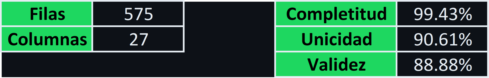

- [Introducción](#introducción)
- [Contenido del Repositorio](#contenido-del-repositorio)
- [Metodología de Trabajo](#metodología-de-trabajo)
  - [Extracción y Transformación](#extracción-y-transformación)
  - [Evaluación de Calidad](#evaluación-de-calidad)
- [Metadata y Estructura de los Datos](#metadata-y-estructura-de-los-datos)
  - [Descripción](#descripción)
  - [Metadata](#metadata)
- [Evaluación de Calidad](#evaluación-de-calidad-1)
  - [Dataset](#dataset)
  - [Columnas](#columnas)
- [Distribución de los Datos](#distribución-de-los-datos)
- [Despedida](#despedida)


# Introducción

Hola! Este repositorio es una prueba técnica sobre la información de la música de Taylor Swift que se encuentra en la API de Spotify. El objetivo principal de esta prueba es entender y aplicar diferentes conceptos y metodologías relacionadas con la evaluación de la calidad de los datos, espero sea de su agrado!

# Contenido del Repositorio

A continuación se presenta una tabla con el contenido de este repositorio.

| ID | Nombre         | Tipo   | Descripcion                                                           |
|----|---------------|--------|-----------------------------------------------------------------------|
| 1  | data          | carpeta | Contiene los datasets base, la metadata y la evaluación de calidad|
| 2  | images | carpeta | Contiene las imagenes y recursos utilizados en este repo      |
| 3  | my_utils | carpeta | Contiene scripts personalizados creados por mí que suelo usar casi siempre|
| 4  | my_utils/my_utils | .py | Contiene el código de mis funciones personalizadas|
| 5  | my_utils/my_utils | .pyi | Contiene los docString de mis funciones personalizadas|
| 6  | EDA | .ipynb | Contiene el desarrollo de toda la segunda parte de la consigna (Evaluación de calidad)|
| 7  | ETL | .ipynb | Contiene el desarrollo de toda la primera parte de la consigna (Transformación de datos)|
| 8  | instrucciones | .pdf | Las instrucciones de la prueba técnica|
| 9  | requirements | .txt | Lista de librerias utilizadas en el desarrollo de la prueba |

# Metodología de Trabajo

La metodología de trabajo se divide en 2 grandes componentes principales, una para cada parte de la prueba asignada. Cada una de estas metodologías se explica detalladamente en los archivos **EDA.ipynb** y **ETL.ipynb**, por favor revisarlos con detenimiento. No obstante citaré nuevamente la metodología explicada en dichos archivos a continuación.

## Extracción y Transformación

Con el fin de transcribir la información del archivo **JSON** a un archivo **.CSV** se creará un dataframe que contenga la información de cada nivel de anidación del archivo **JSON**. Cada dataframe contendrá a su vez una columna que le permita relacionarse con el nivel de anidación anterior para, finalmente, obtener un dataframe final con la totalidad de la información del archivo JSON desanidada.

Dada la estructura del JSON, es conveniente acoplar los 2 primeros niveles del JSON directamente en un dataframe. De esta forma, solo será necesario relacionar 2 dataframes:

* df_albums: Contiene la información del 1er y 2do nivel del JSON
* df_tracks: Contiene la información del 3er nivel del JSON desanidada

El dataframe final se exportará en formato **.CSV** cumpliendo así con la primera consigna.

## Evaluación de Calidad

En este archivo se utilizarán diversas librerías de Python que nos permiten realizar un análisis general y exhaustivo del dataset. Esto incluye métricas para la calidad de los datos, así como algunas gráficas que nos permitirán entender mejor los datos con los que estamos trabajando. Todos los hallazgos relevantes obtenidos en este notebook serán luego presentados de forma más ordenada en un reporte en formato MarkDown.

En este reporte de calidad buscaremos evaluar las siguientes 3 dimensiones de calidad de los datos:

* Completitud
* Unicidad
* Validez

Estas dimensiones se evaluarán tanto para el **dataframe**, como para sus **columnas** de forma individual. Dadas las características de esta prueba técnica, quedan fuera del alcance de este reporte las siguientes dimensiones de calidad:

* Precisión: Se requiere una fuente secundaria de información con el fin de confirmar y contrastar la veracidad de los datos. Si los datos provienen de la API de spotify, doy por sentada su veracidad ya que la información es cargada por los mismos artistas/disqueras (Aún así está sujeta a error).
* Temporalidad: No se están manejando series de tiempo en este dataset, así que se omite.
* Consistencia: Se requiere una base de datos secundaria con el fin de calcular la consistencia. Se podría usar la información de la API de Deezer, por ejemplo, para verificar si la información del artista y de sus canciones es homogénea. Sin embargo, esto puede causar sesgos de percepción en la información, ya que puede que un artista no paute en ambas plataformas o que sea selectivo con el contenido que sube a cada una.

# Metadata y Estructura de los Datos

Para esta prueba técnica se trabajo con un archivo JSON que contaba con 3 niveles principales de anidación. A continuación se muestra un fragmento de ejemplo de la estructura de los datos de la API:

```JSON
{
    "artist_id": "06HL4z0CvFAxyc27GX",
    "artist_name": "Taylor Swift",
    "artist_popularity": 120,
    "albums": [
        {
            "album_id": "1o59UpKw81iHR0HPiSkJR0",
            "album_name": "1989 (Taylor's Version) [Deluxe]",
            "album_release_date": "2023-10-27",
            "album_total_tracks": 22,
            "tracks": [
                {
                    "disc_number": 1,
                    "duration_ms": 212600,
                    "explicit": false,
                    "track_number": 1,
                    "audio_features": {
                        "danceability": 0.757,
                        "energy": 0.61,
                        "key": 7,
                        "loudness": -4.84,
                        "mode": 1,
                        "speechiness": 0.0327,
                        "acousticness": 0.00942,
                        "instrumentalness": 3.66e-05,
                        "liveness": 0.367,
                        "valence": 0.685,
                        "tempo": 116.998,
                        "id": "4WUepByoeqcedHoYhSNHRt",
                        "time_signature": 4
                    },
                    "track_popularity": 77,
                    "track_id": "4WUepByoeqcedHoYhSNHRt",
                    "track_name": "Welcome To New York (Taylor's Version)"
                }
```
Como se puede observar, el archivo JSON cuenta con 27 llaves y datos de toda índole. 

## Descripción
Con el fin de entender mejor los datos, así como su estructura, se presenta una tabla que resume apropiadamente el significado de cada entrada, así como su metadata esencial.


## Metadata
Ahora a continuación se presenta la metadata que contiene la siguiente información:

* Nombre de la columna
* Descripción del contenido
* Tipo de dato que contiene
* Clase (Categórica / Cuantitativa)
* Sub-Clase (Nominal / Ordinal - Discreta / Continua)
* Mínimo (Si aplica)
* Máximo (Si aplica)
* Formato (Si aplica)

<br>


# Evaluación de Calidad

La evaluación de calidad se realizó tanto para el dataset a nivel general, como para las columnas a modo individual, tal como se explica en la metodología de trabajo.

## Dataset

Para la evaluación de calidad del dataset se evaluaron las métricas de **Completitud**, **Unicidad** y **Validez**. Cada una de estas métricas se explica en detalle en el archivo **EDA.ipynb**. Cabe destacar que dada la metodología de trabajo que seguí, no me fue posible hallar la métrica de validez general para todo el dataset hasta que realicé la evaluación de validez por columnas. La metodología que usé para hallar el grado de validez general del dataset consistió en calcular la proporción de columnas que no eran validas con respecto a los 3 criterios de validez utilizados en el análisis que fueron:

* Tipo de Dato
* Alcance del Rango (Máximos y mínimos permitidos)
* Formato

Por cada criterio se evaluaron las 27 columnas, obteniendo así 81 indicadores, de los cuales 9 fueron identificados como no satisfactorios / baja calidad. Por lo tanto el cálculo de la validez fue: 

((81-9)/81) * 100

Dando como resultado: 88.88%.

A continuación se muestra un resumen de la evaluación de calidad general del dataset:



Cabe destacar que se encontraron 54 filas duplicadas en el dataset y 0 filas que fueran completamente nulas.

## Columnas

Para la evaluación de Calidad de las columnas se desarrollaron diversos Scripts para realizar las evaluaciones de forma automática. Todo el código está explicado en el archivo **EDA.ipynb**. Finalmente, gran parte de los hallazgos e indicadores de calidad se resumieron en un cuadro que resume el valor del indicador para cada columna. Los números de color rojo son insuficientes y presentan alguna falla en la métrica en cuestión, por mínima que sea. Gran parte de los datos tienen defectos en la calidad de tan solo el 1%. Sin embargo, muchos otros están en 0 y deben ser revisados con cautela. A continuación se presenta el significado de las siglas utilizadas en cada dimensión de calidad.


Ahora bien, se presenta el cuadro resumen con todas las métricas por columna.


# Distribución de los Datos

Ya para finalizar el resumen del reporte, se presenta un conjunto de histogramas por cada columna cuantitativa evaluada en esta prueba de calidad! Este histograma no solo permite entender mejor la distribución y tendencia central de los datos, sino que además fue muy útil para detectar rápidamente valores atípicos y anomalías en la información. Además, fue esencial para comprobar los resultados que obtuve mediante el desarrollo y uso de mis Scripts.


# Despedida

Espero que mi trabajo haya sido de su agrado! Si queda alguna duda o inquietud respecto a este repositorio no duden en contactarme y muchas gracias por la prueba, fue muy divertida para mí ✌️.